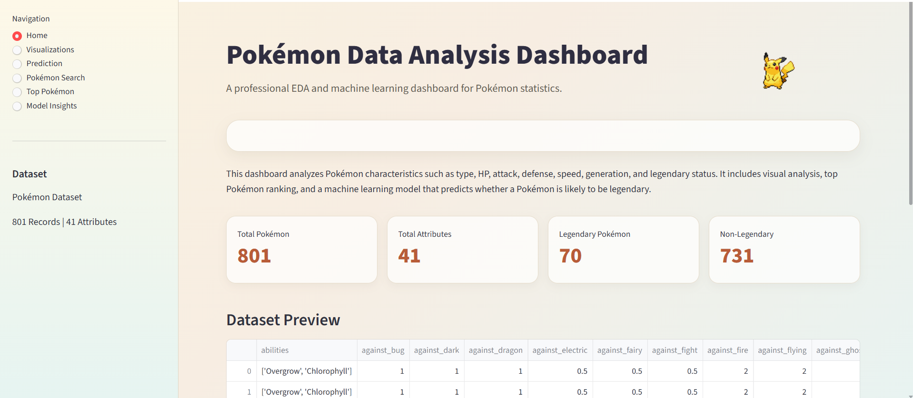
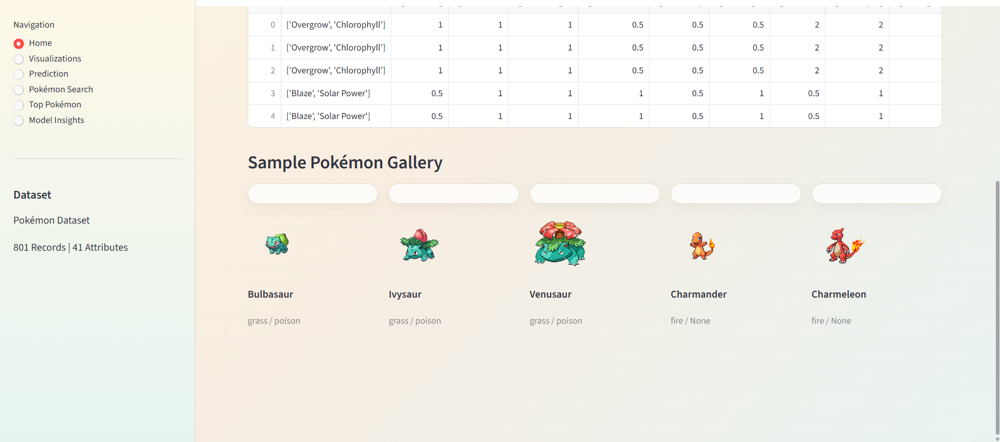
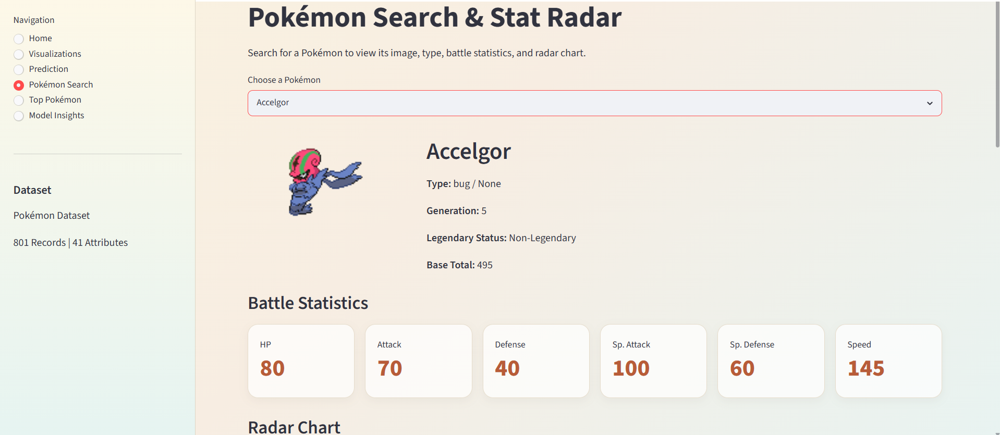
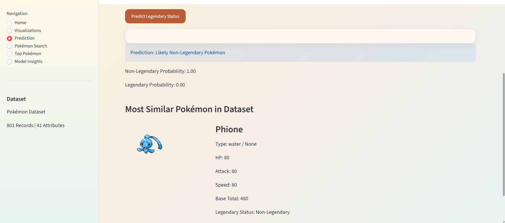
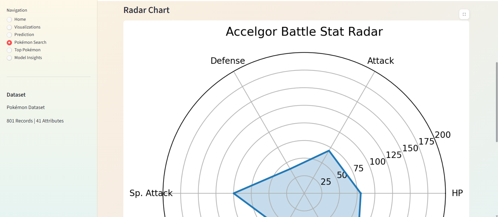
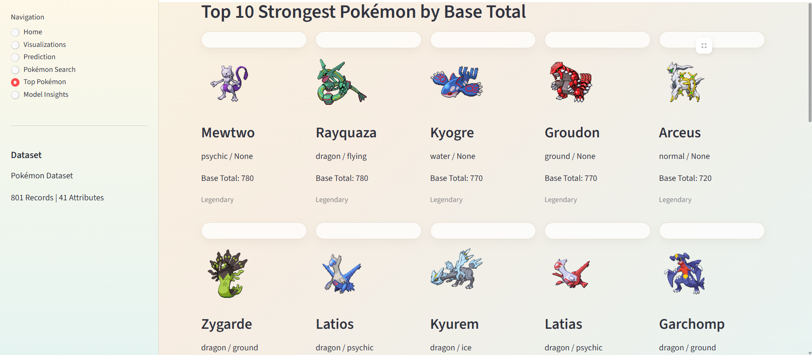

# ⚡ Pokémon Analytics Dashboard

<p align="center">
  <strong>An interactive data analytics and machine learning dashboard for exploring Pokémon statistics, visualizing trends, and predicting Legendary status using Streamlit and Random Forest.</strong>
</p>

<p align="center">


</p>

---

# 📖 Overview

Pokémon Analytics Dashboard is an interactive data science application that combines exploratory data analysis (EDA), machine learning, and visualization to analyze Pokémon statistics.

The application enables users to explore Pokémon data, visualize battle statistics, compare Pokémon, identify the strongest Pokémon, and predict whether a Pokémon is likely to be Legendary using a trained Random Forest classifier.

---

# ✨ Features

- 📊 Interactive dashboard
- 📈 Exploratory Data Analysis (EDA)
- 🔍 Pokémon search
- 🏆 Top Pokémon rankings
- ⚔ Battle statistics visualization
- 📡 Radar chart comparison
- 🤖 Legendary Pokémon prediction
- 🎯 Random Forest Machine Learning model
- 🖼 Pokémon image gallery
- 📋 Dataset preview

---

# 🛠 Tech Stack

### Languages

- Python

### Framework

- Streamlit

### Data Analysis

- Pandas
- NumPy

### Machine Learning

- Scikit-Learn
- Random Forest Classifier

### Visualization

- Plotly
- Matplotlib

---

# 📸 Application Preview

## Dashboard Overview



---

## Pokémon Gallery



---

## Pokémon Search



---

## Legendary Prediction



---

## Radar Chart



---

## Top Pokémon Rankings



---

# 📊 Dashboard Modules

### 🏠 Home Dashboard

- Dataset overview
- Pokémon statistics
- Dataset preview
- Image gallery

---

### 📈 Visualizations

- Interactive charts
- Statistical insights
- Pokémon distribution
- Comparative analysis

---

### 🤖 Legendary Prediction

Predicts whether a Pokémon is likely to be Legendary using a trained Random Forest model.

Output includes:

- Prediction result
- Legendary probability
- Non-Legendary probability
- Most similar Pokémon

---

### 🔍 Pokémon Search

Search any Pokémon to view:

- Image
- Generation
- Type
- Battle Statistics
- Base Total
- Radar Chart

---

### 🏆 Top Pokémon

Displays the strongest Pokémon ranked by:

- Base Total
- Battle Statistics
- Legendary Status

---

# 🤖 Machine Learning Model

The project uses a **Random Forest Classifier** trained on Pokémon battle statistics.

### Input Features

- HP
- Attack
- Defense
- Special Attack
- Special Defense
- Speed
- Base Total
- Type Information

### Prediction

- Legendary
- Non-Legendary

---

# 📂 Project Structure

```text
Pokemon-Analytics-Dashboard
│
├── app.py
├── data
├── models
├── notebooks
├── images
│   ├── Dashboard.png
│   ├── Gallery.png
│   ├── Search.png
│   ├── Prediction.png
│   ├── Radar.png
│   └── top.png
│
├── requirements.txt
└── README.md
```

---

# 🚀 Installation

Clone the repository

```bash
git clone https://github.com/YOUR_USERNAME/Pokemon-Analytics-Dashboard.git
```

Install dependencies

```bash
pip install -r requirements.txt
```

Run the application

```bash
streamlit run app.py
```

---

# 📈 Dataset

The application uses the Pokémon dataset containing:

- **801 Pokémon**
- **41 Attributes**
- Battle Statistics
- Types
- Generations
- Legendary Status

---

# 🎯 Future Improvements

- Pokémon comparison mode
- Team builder
- Evolution tree visualization
- Type effectiveness calculator
- Deep Learning prediction model
- Pokémon recommendation engine
- Online deployment
- User favorites

---

# 👩‍💻 Author

**Naima Khalid**

Software Engineering Student

Python Developer | Machine Learning Enthusiast

GitHub: https://github.com/naimak127-code

LinkedIn: https://linkedin.com/in/YOUR_PROFILE

---

# ⭐ Support

If you found this project useful, consider giving it a ⭐ on GitHub!
